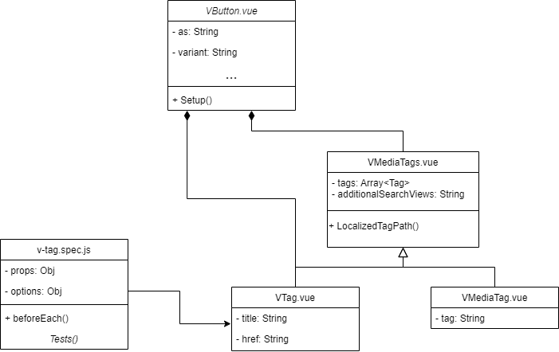
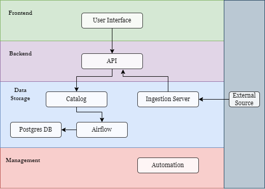

# Report for assignment 4

## Project

### Main project

Name: Openverse

URL: https://github.com/WordPress/openverse

Openverse is a platform and search engine for openly licensed media content, such as GPL-compatible images, audio, and more.

### Second project

Name Companion

URL: https://github.com/bitfocus/companion

Bitfocus Companion enables the user to customize their Elgato streamdeck.

## Onboarding experience

We had not worked with the project beforehand. The onboarding was quite a bit more time consuming, but that is also in part due to the nature of the project. For example, the previous project we worked on only had one main component that you would run and test. In the case of Openverse, it consists of many different parts that can be ran and tested independently. Fortunately the documentation on how to run and test the frontend was good.

## Effort spent

For each team member, how much time was spent in

1. plenary discussions/meetings;

2. discussions within parts of the group;

3. reading documentation;

4. configuration and setup;

5. analyzing code/output;

6. writing documentation;

7. writing code;

8. running code?

For setting up tools and libraries (step 4), enumerate all dependencies
you took care of and where you spent your time, if that time exceeds
30 minutes.

Benjamin:
Felix:
Isadora:
Jonatan:
Rasmus: 2, 1, 5, 3, 4, 6, 1, 1

## Overview of issue(s) and work done.

Title: Refactor and improve VTag component

URL: https://github.com/WordPress/openverse/issues/3190

The changes include forwarding all props to the inner VButton. Using slots instead of props for content. Accessible labels as well as testing for VTags.

This affects the following components: VTag, VMediaTags, VButton, and VMediaTag.

## Requirements for the new feature or requirements affected by functionality being refactored

### Requirements for issue 1

| **ID** | **Title**       | **Description**                                                                 | **Met?** |
| ------ | --------------- | ------------------------------------------------------------------------------- | -------- |
| 1      | Prop Forwarding | All props in the VTag should be forwarded to the inner VButton                  | X        |
| 2      | Event Emitting  | All events from the inner VButton should be emitted to the VTag                 | X        |
| 3      | Slot            | The content should be displayed with a slot instead of a prop.                  | X        |
| 4      | Labels          | Links should have accessible labels to clearly indicate that the link is a tag. | X        |
| 5      | Tests           | The VTag component should have a test suite.                                    | X        |

### Requirements for issue 2

| **ID** | **Title**    | **Description**                                                                                                                | **Met?** |
| ------ | ------------ | ------------------------------------------------------------------------------------------------------------------------------ | -------- |
| 1      | Step name    | Each step component should have a name property. If this name is not empty, it should be displayed instead of the step number. | X        |
| 2      | Edit name    | The user should be able to edit the step name by double-clicking the tab                                                       | X        |
| 3      | Persist name | The name should be persisted, so step names remains after application restart.                                                 |          |

## Code changes

### Patch

[Patch for Issue 1](issue1.patch)

[Patch for Issue 2](issue2.patch)

Optional (point 4): the patch is clean. Our patches fulfill all criteria for a clean patch.

## Test results

Overall results with link to a copy or excerpt of the logs (before/after
refactoring).

## UML class diagram and its description

### Key changes/classes affected

**Optional (point 1): Architectural overview.**

The purpose of Openverse is to provide a platform for creators to find and use openly licensed content. The key is to make it easier for content creators to discover and use a wide range of openly licensed media assets such as images, audio, and videos and more for their projects.

The architecture, consists of the following parts:

#### User interface

The user interface serves as the front-end of the Openverse platform, providing users with a visually appealing and intuitive interface to interact with the system. This is how a user can easily interact with the content available at the platform. The official openverse user interface consists of the search engine that may be found at https://openverse.org/en-gb.

#### API

The API acts as an entry point for client applications to interact with the various features within Openverse. Most notably it lets developers access the content through their own applications. Many apps and extensions are powered by this API, such as the official [search engine](https://openverse.org/en-gb) or the extension to [slack](https://openverse-slack.sarayourfriend.pictures/slack/).

The API handles authentication through tokens, querying of images, audio and other forms of content based on content creator, source or tags. It also allows the developer to get stats for images.

#### Catalog

The catalog consists of two parts, an airflow instance and a postgres instance. Airflow is used for managing complex workflows and data pipelines. In this case it has two different deployment mechanisms: service deployments and DAG deployments.

The Postgres database is hosted on AWS and acts as the primary storage for all ingested media.

#### Ingestion Server

The Ingestion Server is a small API for copying data from an external source and loading it into the Openverse API. It is needed for collecting, processing, and storing incoming data efficiently and reliably.

#### Automation

Automation refers to scripts and tools that aim to automate various workflows and processes related to the management of the project. This is for example used in integration with CI, as it allows for setting git commit statuses etc. This integrates with multiple different parts of the system architecture.

Optional (point 2): relation to design pattern(s).

## Overall experience

What are your main take-aways from this project? What did you learn?

- Documentation and onboarding is increadibly important
- Issues, forking and other github features are really useful when working on open source projects
- Add more here

How did you grow as a team, using the Essence standard to evaluate yourself?

As a team, we are in the collaborating stage.

**Optional (point 6): How would you put your work in context with best software engineering practice?**

Starting with the requirements, while they were given as the issue was already created – and thus they align with stakeholder scope – they did influence the work a lot. It could also be noted that there were many drawbacks with the requirements given in the issue, when referencing the checklist in Essence (p.38) it is clear that the requirements given were not meeting all points. The scope was somewhat defined, but there is a clear lack of answers to the question: Why should these requirements/changes be implemented? Which makes the coherence suffer. There is no link between the requirement and what opportunity it is addressing. Thus something we could have done better was to understand the requirements better and document the actual point of why the changes are necessary.

As for the alpha: Work, we have moved throughout the different states during the project. We initiated the work through clear priorities and then prepared for the work. The issue was broken down into smaller issues that allowed for us to parallelise the work. A drawback here is that we potentially could have covered more issues if we wouldn't have split up the issue into multiple smaller ones, since this meant every team member had to go through the initial learning phase of the issue. That being said, we put a plan in place, after which we started the work. We monitored the progress through issue trackers in a forked repository, which worked really well. The work was always under control and the initial tasks were completed on time. That being said, we did not have time to complete all the issues we continuously added. Something that we could have improved upon by setting up a clearer plan at the start, with more issues lined up, that way we could have structured all of the work better. As for concluding the work, our patch has not yet been accepted by Openverse, so this remains to be seen. We have documented our lessons learned in this report which has been really helpful, apart from some uncompleted issues, the initial work is complete with no tasks outstanding.

**Optional (point 7): Is there something special you want to mention here?**

- We have done work on two different projects, both: [Openverse](https://github.com/WordPress/openverse) and [Companion](https://github.com/bitfocus/companion).

**Optional (point 8):**

WordPress Openverse belongs to the open-source software ecosystem. This means anyone is free to look at the source code, modify it, or contribute to the project through solving issues or improving the documment. This is unlike much of the other proprietary software.

**Does it replace similar proprietary software?**
While Openverse offers functionalities similar to some proprietary software, it doesn't directly replace them due to a few key reasons:

Proprietary software like Adobe Stock has a wider range of advanced features compared to that of Openverse. The difference is also clear with regards to the target audience. Adobe stock caters to a more professional group of designers, that might need more advanced features. Openverse on the other hand is a user-friendly platform perfect for people who want to use openly licensed media in their online content. Another main benefit of Openverse is that it can easily be integrated with Wordpress websites.
